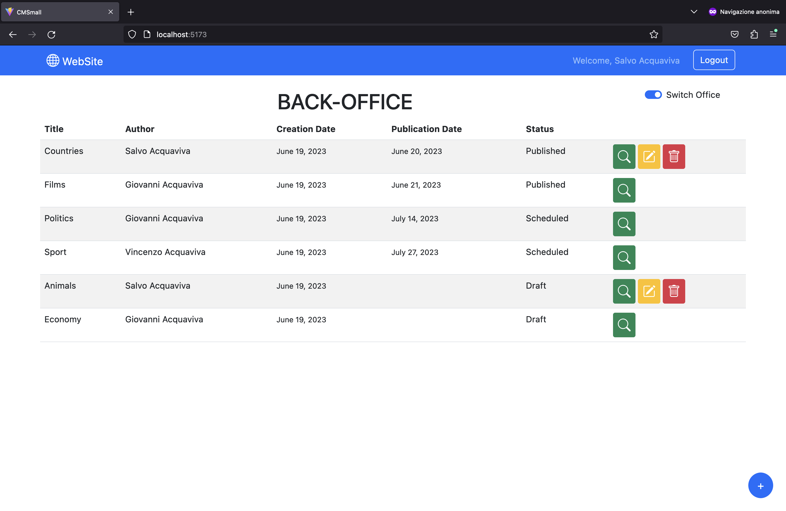
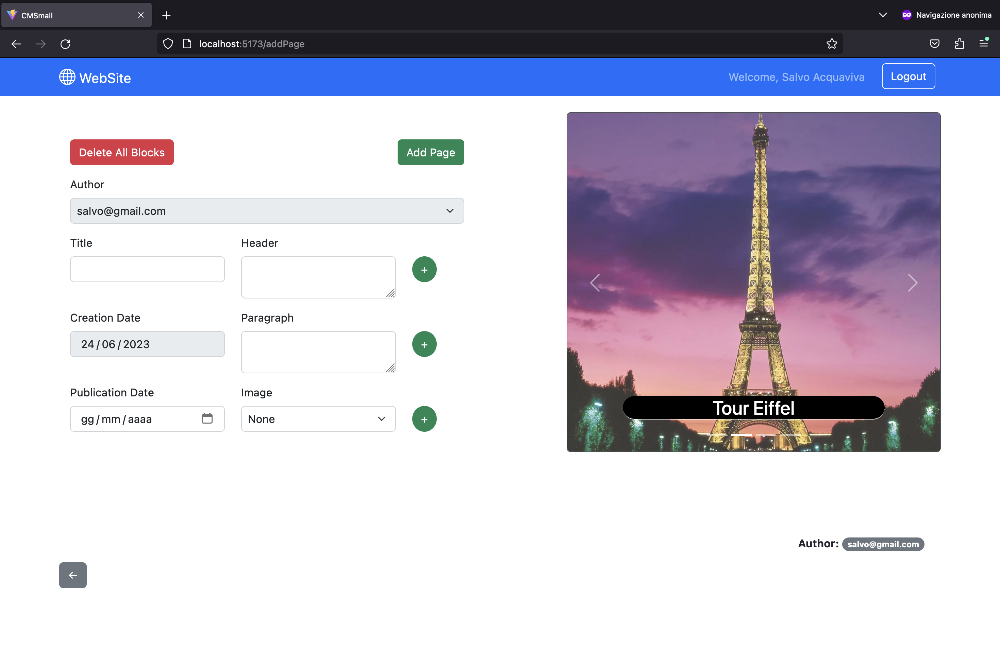

[](https://classroom.github.com/a/_XpznRuT)
# Exam #1: "CMSmall"

## Student: s316931 ACQUAVIVA SALVATORE 

# Server side

## API Server

### CMS management

#### Get the name of the website
- GET `/api/websiteName`
  - Request body: None
  - Response: `200 OK` (success)
  - Response body: One object containing the name of the website
  ```json
    {
      "name": "WebSite"
    }
  ```
  - Error responses: `500 Internal Server Error` (generic error), `404 Not Found` (not present or unavailable)

#### Update the name of the website
- PUT `/api/updateWebsiteName`
  - Request body: The new name of the website
  ``` json
    {
      "newName": "New WebSite"
    }
  ```
  - Response: `200 OK` (success)
  - Response body: One object containing the new name of the website
  ```json
    {
      "name": "New WebSite"
    }
  ```
  - Error responses: `503 Service Unavailable` (database error), `422 Unprocessable Entity`, `401 Unauthorized`


#### Get published pages

- GET `/api/publishedPages`
  - Request body: None
  - Response: `200 OK` (success)
  - Response body: Array of objects, each describing one published page
  ```json
  [
    {
      "page_id": 2,
      "title": "Countries",
      "user_id": 0,
      "name": "Salvo",
      "surname": "Acquaviva",
      "creation_date": "2023-06-19",
      "publication_date": "2023-06-20"
    },
    {
      "page_id": 5,
      "title": "Films",
      "user_id": 3,
      "name": "Giovanni",
      "surname": "Acquaviva",
      "creation_date": "2023-06-19",
      "publication_date": "2023-06-21"
    }
  ]
  ```
  - Error responses: `500 Internal Server Error` (generic error)

#### Get all pages

- GET `/api/allPages`
  - Request body: None
  - Response: `200 OK` (success)
  - Response body: Array of objects, each describing one page
  ```json
  [
    {
      "page_id": 1,
      "title": "Animals",
      "user_id": 0,
      "name": "Salvo",
      "surname": "Acquaviva",
      "creation_date": "2023-06-19",
      "publication_date": null
    },
    {
      "page_id": 2,
      "title": "Countries",
      "user_id": 0,
      "name": "Salvo",
      "surname": "Acquaviva",
      "creation_date": "2023-06-19",
      "publication_date": "2023-06-20"
    },
    {
      "page_id": 3,
      "title": "Sport",
      "user_id": 1,
      "name": "Vincenzo",
      "surname": "Acquaviva",
      "creation_date": "2023-06-14",
      "publication_date": "2023-07-27"
    },
    {
      "page_id": 4,
      "title": "Economy",
      "user_id": 3,
      "name": "Giovanni",
      "surname": "Acquaviva",
      "creation_date": "2023-06-19",
      "publication_date": null
    },
    {
      "page_id": 5,
      "title": "Films",
      "user_id": 3,
      "name": "Giovanni",
      "surname": "Acquaviva",
      "creation_date": "2023-06-19",
      "publication_date": "2023-06-21"
    },
    {
      "page_id": 6,
      "title": "Politics",
      "user_id": 3,
      "name": "Giovanni",
      "surname": "Acquaviva",
      "creation_date": "2023-06-20",
      "publication_date": "2023-07-15"
    }
  ]
  ```
  - Error responses: `500 Internal Server Error` (generic error), `401 Unauthorized`

#### Get page by id
- GET `/api/pages/:page_id`
  - Request body: None
  - Response: `200 OK` (success)
  - Response body: An object describing a page with all its blocks
  ```json
  {
    "page_id": 5,
    "title": "Films",
    "user_id": 3,
    "email": "giovanniAdmin@gmail.com",
    "name": "Giovanni",
    "surname": "Acquaviva",
    "creation_date": "2023-06-19",
    "publication_date": "2023-06-21",
    "blocks": [
        {
          "block_id": 6,
          "type": "Header",
          "content": "Interstellar",
          "position": 1
        },
        {
          "block_id": 8,
          "type": "Image",
          "content": "Interstellar.jpeg",
          "position": 2
        }
      ]
  }
  ```
  - Error responses: `500 Internal Server Error` (generic error), `422 Unprocessable Entity`, `404 Not Found` (not present or unavailable)

#### Add a new page
- POST `/api/pages`
  - Request body: Description of the page to add and relative blocks (the creation date is set to today's date; author is set to the id of the logged user)
  ```json
    {
      "title": "Roads",
      "publicationDate": "2023-07-03",
      "blocks": [
                  {"type": "Header", "content": "The route 66", "position": 1},
                  {"type": "Paragraph", "content": "The most famous road in the world", "position": 2},
                  {"type": "Image", "content": "Route_66.jpeg", "position": 3}
              ]
    }
  ```
  - Response: `200 OK` (success)
  - Response body: An object describing the new page added with all its blocks
  ```json
  {
    "page_id": 7,
    "title": "Roads",
    "email": "giovanniAdmin@gmail.com",
    "name": "Giovanni",
    "surname": "Acquaviva",
    "creation_date": "2023-06-23",
    "publication_date": "2023-06-23",
      "blocks": [
        {
          "block_id": 184,
          "type": "Paragraph",
          "content": "The most famous road in the world",
          "position": 2
        },
        {
          "block_id": 185,
          "type": "Header",
          "content": "The route 66",
          "position": 1
        },
        {
          "block_id": 186,
          "type": "Image",
          "content": "Route_66.jpeg",
          "position": 3
        }
      ]
  }
  ```
  - Error responses: `503 Service Unavailable` (database error), `422 Unprocessable Entity`, `401 Unauthorized`, `400 Bad Request`

#### Update an existing page
- PUT `/api/pages/:page_id`
  - Request body: Description of the page to update and relative blocks (the creation date, if present, is ignored)
  ```json
    {
      "page_id": 2,
      "title": "Roads",
      "publicationDate": "2023-06-20",
      "authorEmail": "salvo@gmail.com",
      "blocks": [
                  {"type": "Header", "content": "The route 66", "position": 1},
                  {"type": "Paragraph", "content": "The most famous road in the world", "position": 2},
                  {"type": "Image", "content": "Route_66.jpeg", "position": 3}
              ]
    }
  ```
  - Response: `200 OK` (success)
  - Response body: An object describing the page updated with all its blocks
  ```json
  {
    "page_id": 2,
    "title": "Roads",
    "email": "salvo@gmail.com",
    "name": "Salvo",
    "surname": "Acquaviva",
    "creation_date": "2023-06-19",
    "publication_date": "2023-06-20",
    "blocks": [
        {
          "block_id": 187,
          "type": "Header",
          "content": "The route 66",
          "position": 1
        },
        {
          "block_id": 188,
          "type": "Image",
          "content": "Route_66.jpeg",
          "position": 3
        },
        {
          "block_id": 189,
          "type": "Paragraph",
          "content": "The most famous road in the world",
          "position": 2
        }
      ]
  }
  ```
  - Error responses: `503 Service Unavailable` (database error), `422 Unprocessable Entity`, `404 Not Found` (not present or unavailable), `401 Unauthorized`, `400 Bad Request`

#### Delete an existing page
- DELETE `/api/pages/:page_id`
  - Request body: None
  - Response: `200 OK` (success)
  - Response body: an empty object
  - Error responses: `503 Service Unavailable` (database error), `422 Unprocessable Entity`, `404 Not Found` (not present or unavailable), `401 Unauthorized`

### User management

#### Login

- POST `/api/sessions`
  - Request body: Credentials of the user who is trying to login
  ```json
  {
    "username": "giovanniAdmin@gmail.com",
    "password": "11223344"
  }
  ```
  - Response: `200 OK` (success)
  - Response body: Authenticated user
  ```json
  {
    "user_id": 3,
    "email": "giovanniAdmin@gmail.com",
    "name": "Giovanni",
    "surname": "Acquaviva",
    "admin_role": 1
  }
  ```
  - Error responses: `500 Internal Server Error` (generic error), `401 Unauthorized` (login failed)
  
#### Check if user is logged in
- GET `/api/sessions/current`
  - Request body: None
  - Response: `200 OK` (success)
  - Response body: Authenticated user
  ```json
  {
    "user_id": 3,
    "email": "giovanniAdmin@gmail.com",
    "name": "Giovanni",
    "surname": "Acquaviva",
    "admin_role": 1
  }
  ```
  - Error responses: `500 Internal Server Error` (generic error), `401 Unauthorized` (user is not logged in)

#### Logout
- DELETE `/api/sessions/current`
  - Request body: None
  - Response: `200 OK` (success)
  - Response body: An empty object
  - Error responses: `500 Internal Server Error` (generic error)

#### Get all the user emails
- GET `/api/users`
  - Request body: None
  - Response: `200 OK` (success)
  - Response body: An array containing all the user emails and their own user_id
  ```json
  [
   {
    "user_id": 2,
    "email": "daniele@gmail.com"
    },
    {
      "user_id": 4,
      "email": "enzaAdmin@gmail.com"
    },
    {
      "user_id": 3,
      "email": "giovanniAdmin@gmail.com"
    },
    {
      "user_id": 0,
      "email": "salvo@gmail.com"
    },
    {
      "user_id": 1,
      "email": "vincenzo@gmail.com"
    }
  ]
  ```
  - Error responses: `500 Internal Server Error` (generic error), `401 Unauthorized`

## Database Tables

- Table `users` - contains the registered users (user_id, email, name, surname, password, salt, admin_role)
- Table `pages` - contains all the created pages (page_id, title, author, creation_date, publication_date)
- Table `blocks` - contains all the informations about blocks related to a specific page (block_id, type, content, position, page_id)
- Table `website`- contains the name of the website (name)

# Client side


## React Client Application Routes

- Route `/`: Main page for both authenticated and not authenticated users, contain the list of all pages or only those published, depending on the Office
- Route `/login`: Login page. Once login is done, it redirects to `/`
- Route `/pages/:page_id`: Page where you can see all the details of a certain page (specified by the param 'page_id')
- Route `/addPage`: Page that allows to create a new page by submitting a specific form
- Route `/editPage/:page_id`: Page that allows to edit a certain page (specified by the param 'page_id')


## Main React Components

- `LoginForm` (in `Auth.jsx`): It's the component where the login form is rendered. It handles the login procedure invoking the appropriate API in App.jsx. LoginForm also shows an alert in case of credentials errors
- `Navigation` (in `Navigation.jsx`): It's the Navbar component. Here, the name of the website is shown, near the name of the user (if logged in) and the Login/Logout button
- `FrontOfficeLayout` (in `Layout.jsx`): In this component, all the published pages are retrieved and passed to the child component that deals the rendering phase
- `BackOfficeLayout` (in `Layout.jsx`): In this component, all the pages are retrieved and passed to the child component that deals the rendering phase. Here also the editWebsiteName and deletePage methods are defined which manage the call to the respective API.
- `PageTable` (in `PageLibrary.jsx`): Component that shows the list of pages. Since it's shared with FrontOfficeLayout and BackOfficeLayout, it will render all the pages or only the published ones. Moreover, an alert is shown when user clicks a delete button to make him sure of the deletion.
- `SinglePage` (in `SinglePage.jsx`): It's the component that renders all the page details. Its only functionality is, therefore, retrieving and displaying the information about a single page
- `BelowNavLayout` (in `Layout.jsx`): Component that renders the upper part of the main page ('/'). There is a button in the BackOffice (for Admin only) to show the form dealing the editing of the website name. Also, a switch element allows to change office from FrontOffice to BackOffice (and vice versa)
- `AddLayout` (in `Layout.jsx`): Component managing the call to addPage API. Rendering is the job of the PageForm component
- `EditLayout` (in `Layout.jsx`): Component managing the call to updatePage API. Rendering is the job of the PageForm component. There is also a mechanism to retrieve all the info about the page that you want to edit
- `PageForm` (in `PageForm.jsx`): Component shared between AddLayout and EditLayout dealing the rendering of the form to create a page or modify an existing one. PageForm contains also the DynamicPage component which allows to dinamically create and/or modify a page before the submit.

(only _main_ components, minor ones may be skipped)

# Usage info

## Example Screenshot




## Users Credentials

Here you can find a list of the users already registered inside the provided database.

|         email           | plain-text password |
|-----------------------|---------------------|
| salvo@gmail.com    | Spassword            |
| vincenzo@gmail.com    | Vpassword            |
| daniele@gmail.com    | Dpassword            |
| giovanniAdmin@gmail.com    | 11223344            |
| enzaAdmin@gmail.com    | 55667788            |